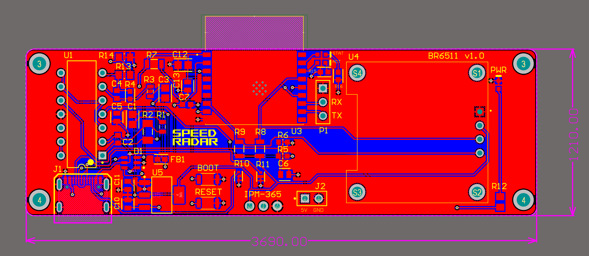

# Doppler Radar Speed Detection System

A custom PCB-based speed measurement system using Doppler radar to estimate thrown projectile 
speeds from reflected RF signals.

## Overview

The system uses an IPM-365 radar transceiver to detect Doppler-shifted signals from 
a moving target. Analog filtering isolates the frequency components of interest; cutoff frequencies
of approximately 1600 Hz and 7200 Hz correspond to the doppler frequency shifts caused by a low end
of possible thrown ball speeds (~25 mph) and a high end (~100 mph). Thus, signals outside this range
are attenuated, improving velocity estimation accuracy. AC coupling in Op-Amp configuration removes DC offset from radar output so only swings are amplified. Reference voltage fed into the Op-Amps (2.5V) allows room for signal to swing without going negative or clipping. Additionally, a voltage divider feeds into a buffer stage which leads to ESP32 ADC to ensure adequate room for the signal not to clip. ESP32 performs FFT-based signal processing 
to compute velocity in real time, displayed on an onboard LCD.

## Hardware

- **Microcontroller:** ESP32
- **Radar Module:** IPM-365 Doppler transceiver
- **Display:** LCD (I2C)
- **Power:** USB-C, 5V input
- **PCB:** Designed in Altium Designer — 2-layer, 93.7 x 30.7 mm

## Programming
- **USB-C** - onboard USB via D+/D- lines to ESP32
- **UART Option** - pin header for external USB-to-UART adapter for UART communication

## Signal Chain

1. IPM-365 outputs raw Doppler IF signal
2. Active high-pass filter removes DC offset
3. Active low-pass filter limits bandwidth to thrown ball speed range
4. ESP32 ADC samples filtered and amplified signal
5. FFT identifies dominant frequency component, from which target velocity is calculated

## PCB

.png)

## Results

[First Assembly + Testing](IMG_0649.jpg)

## Tools

- Altium Designer (schematic capture, PCB layout)
- C (ESP32 firmware)
- Oscilloscope (breadboard prototype validation)
